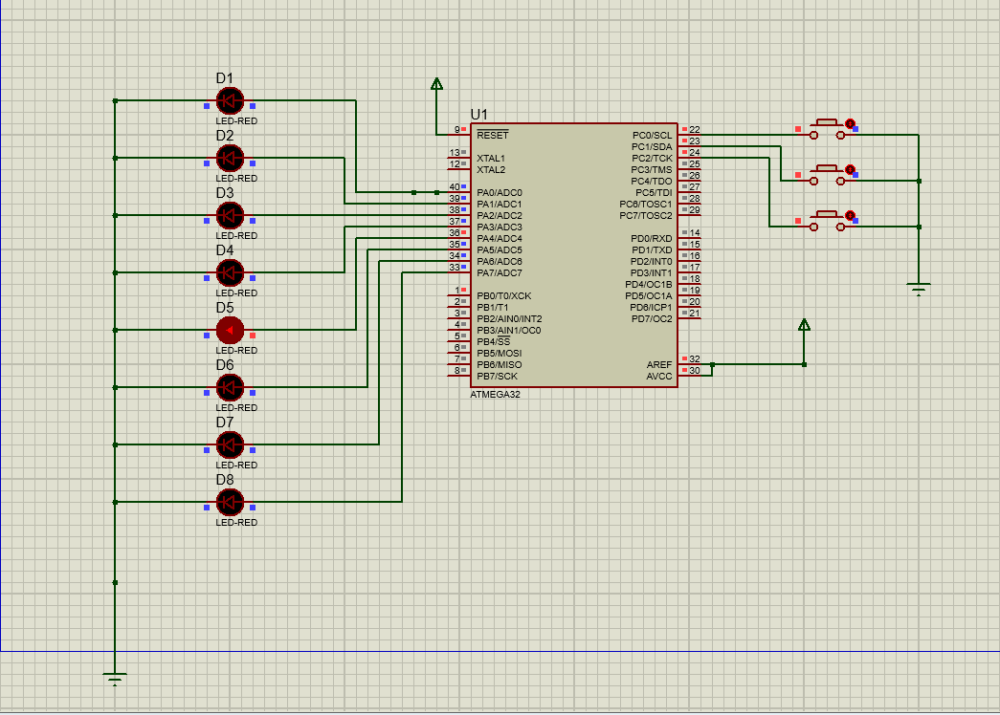

# AVR LED Animation Controller

A simple embedded system project demonstrating **first interfacing code** for AVR microcontrollers. This project controls 8 LEDs connected to **Port A** and provides **button-controlled behavior** using 3 buttons on **Port C**. Includes **software debouncing** for reliable button input.

## Features
- Shift LED pattern **right**, **toggle**, or **shift left** using buttons
- Software debouncing for button inputs
- Simple LED animations for testing **Digital I/O (DIO)**
- Educational "spaghetti code" style for learning and testing basic functionality

## Hardware Requirements
- AVR Microcontroller (e.g., ATmega32, ATmega16)
- 8 LEDs connected to **Port A** via appropriate current-limiting resistors
- 3 push buttons connected to **Port C** with pull-up resistors
- Breadboard and connecting wires
- Power supply for AVR (usually 5V)

## Software Requirements
- Atmel Studio or AVR-GCC toolchain
- Programmer (e.g., USBasp) for flashing the AVR
- Optional: AVR simulator for testing (Proteus or SimAVR)

## Getting Started

### 1. Hardware Setup
1. Connect LEDs to **Port A** pins (PA0 to PA7) with series resistors (220Ω recommended)
2. Connect three buttons to **Port C** pins (PC0: Shift Right, PC1: Toggle, PC2: Shift Left)
3. Ensure buttons are connected to **ground** and configured with pull-up resistors

### 2. Compile and Upload Code
1. Open `main.c` in Atmel Studio or any AVR IDE
2. Configure microcontroller settings (F_CPU, target MCU)
3. Compile the code
4. Upload to your AVR using a programmer

### 3. Run the Program
- Press **PC0** to shift LEDs pattern right
- Press **PC1** to toggle LEDs
- Press **PC2** to shift LEDs pattern left
- LED actions include delay for software debouncing to prevent bouncing effects

  ## AVR LED Animation Simulation

The figure below shows the simulation of the LED animation controller developed using AVR:



- LEDs blink in sequence according to programmed patterns.
- Three push buttons are used to change animation modes.
- Simulation run captured using proteus.

## Code Example Snippet

```c
// main.c - Basic LED Animation with Buttons (AVR)
#include <avr/io.h>
#include <util/delay.h>

#define DEBOUNCE_DELAY 50

int main(void) {
    DDRA = 0xFF;  // Configure Port A as output (LEDs)
    DDRC = 0x00;  // Configure Port C as input (buttons)
    PORTC = 0xFF; // Enable pull-up resistors on buttons

    uint8_t pattern = 0x01; // Initial LED pattern

    while (1) {
        // Shift right button
        if (!(PINC & (1<<PC0))) {
            _delay_ms(DEBOUNCE_DELAY);
            pattern >>= 1;
            PORTA = pattern;
        }
        // Toggle button
        if (!(PINC & (1<<PC1))) {
            _delay_ms(DEBOUNCE_DELAY);
            PORTA ^= 0xFF; // Toggle all LEDs
        }
        // Shift left button
        if (!(PINC & (1<<PC2))) {
            _delay_ms(DEBOUNCE_DELAY);
            pattern <<= 1;
            PORTA = pattern;
        }
        _delay_ms(100);
    }
}
