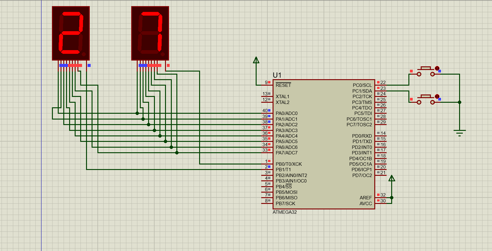

 AVR Two 7-Segments UP/DOWN Counter

This project simulates two connected seven-segment displays using multiplexed persistence-of-vision logic, with buttons to increment and decrement the displayed number in real-time .
## Features
Flicker-free POV multiplexed logic for the displays.
Debounced pushbuttons for reliable input.
Realistic digital counter simulation.

## Hardware Requirements
- AVR Microcontroller (e.g., ATmega32, ATmega16)
- 2 7-Segments connected to **Port A** via appropriate current-limiting resistors
- 2 push buttons connected to **Port C** with pull-up resistors
- Breadboard and connecting wires
- Power supply for AVR (usually 5V)

## Software Requirements
- Atmel Studio or AVR-GCC toolchain
- Programmer (e.g., USBasp) for flashing the AVR
- Optional: AVR simulator for testing (Proteus or SimAVR)

## Circuit Diagram

