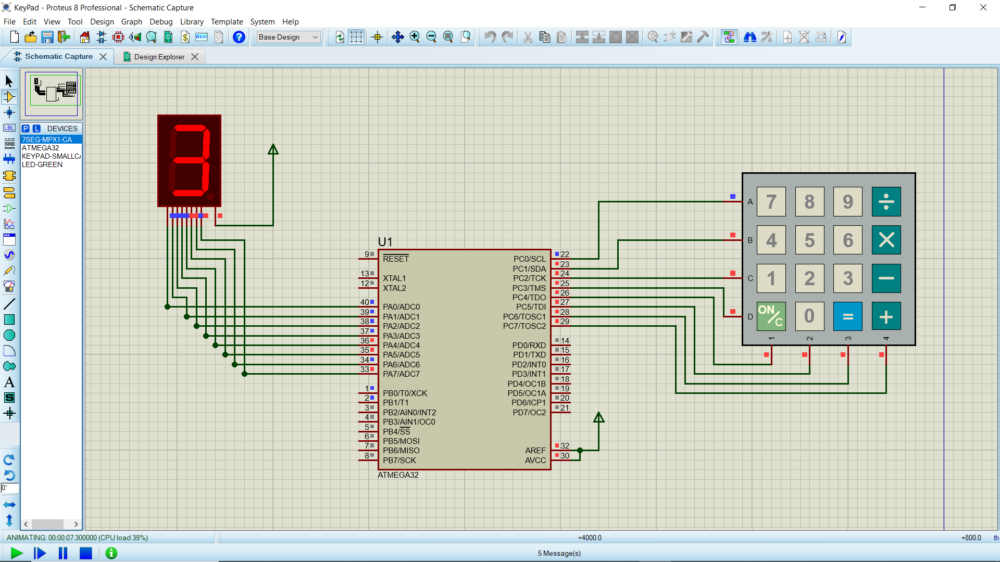

# AVR Keypad and 7-Segment Display Project

## Project Overview
This project demonstrates how to interface a **matrix keypad** and a **7-segment display** with an AVR microcontroller ( ATmega32). The system reads input from the keypad and displays the corresponding number or character on the 7-segment display. For all other keypad characters, the display shows a dash ('-').

It is ideal for learning **basic input-output interfacing**, **debouncing**, and **display control** using AVR microcontrollers.

## Components
- AVR Microcontroller (e.g., ATmega16 or ATmega32)
- 4x4 Matrix Keypad (or 3x4)
- 7-Segment Display (common cathode or anode)
- 220Ω resistors (for current limiting)
- Breadboard and jumper wires
- Power supply (5V)

## Pin Connections

### Keypad to AVR
- Connect rows of the keypad (R1–R4) to **PORTC pins** (PC0–PC3)
- Connect columns of the keypad (C1–C3 or C1–C4) to **PORTC pins** (PC4–PC7)

# AVR Keypad and 7-Segment Display Project

## Project Overview
This project demonstrates how to interface a **matrix keypad** and a **7-segment display** with an AVR microcontroller (e.g., ATmega16/32). The system reads input from the keypad and displays the corresponding number or character on the 7-segment display. For all other keypad characters, the display shows a dash ('-').

It is ideal for learning **basic input-output interfacing**, **debouncing**, and **display control** using AVR microcontrollers.

## Components
- AVR Microcontroller (e.g., ATmega16 or ATmega32)
- 4x4 Matrix Keypad (or 3x4)
- 7-Segment Display (common cathode or anode)
- 220Ω resistors (for current limiting)
- Breadboard and jumper wires
- Power supply (5V)

## Pin Connections

### Keypad to AVR
- Connect rows of the keypad (R1–R4) to **PORTB pins** (PB0–PB3)
- Connect columns of the keypad (C1–C3 or C1–C4) to **PORTB pins** (PB4–PB7)

### 7-Segment Display to AVR
- Connect segments (a–g) through 220Ω resistors to **PORTA pins** (PA0–PA7)
- If using **common cathode**, connect common pin to **GND**
- If using **common anode**, connect common pin to **VCC**

## Features
- Reads keypress from keypad
- Displays numeric input on the 7-segment display
- Displays '-' for non-numeric or undefined keys
- Supports debouncing to prevent multiple detections
- Supports up to 16 keypad inputs (for 4x4 keypad)

## Software Implementation

1. **Keypad Scanning**: Configure rows as outputs and columns as inputs with pull-up resistors. Scan rows sequentially to detect keypress.
2. **Debouncing**: After detecting a keypress, add a small delay to ignore transient signals.
3. **7-Segment Control**: Use a lookup table to map numbers or characters to segment patterns. Output the pattern to PORTC to illuminate the appropriate segments. Display '-' pattern for other keys.

## Circuit Diagram

